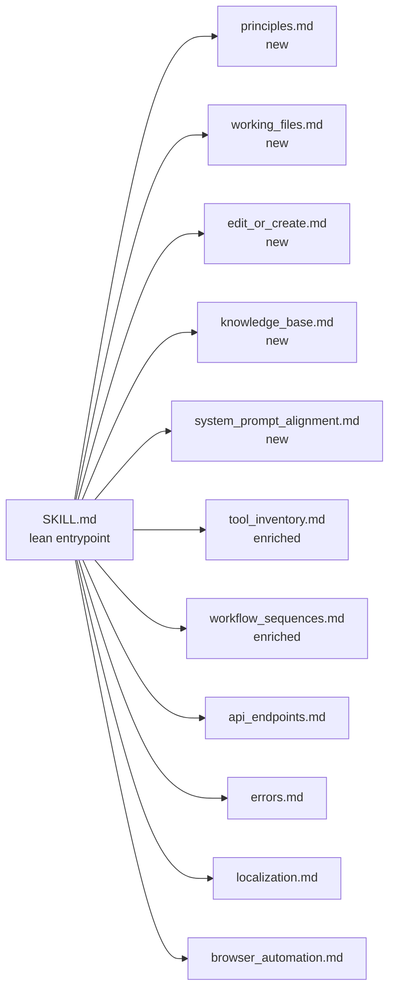

# Relocate Lost SKILL.md Content into `references/`

## Goal

Restore the 10 content blocks lost in the 2026-04-22 reorg (commit `d4e9462`) by distributing them into focused topical files under [`.agents/skills/cmw-platform/references/`](.agents/skills/cmw-platform/references). [`SKILL.md`](.agents/skills/cmw-platform/SKILL.md) becomes a lean entrypoint: one-line stubs + `→ See also: references/X.md` pointers. Source of truth for all lost content is [`SKILL.md.backup`](.agents/skills/cmw-platform/SKILL.md.backup).

## State Verified Against Current Working Tree (2026-05-02)

- Local `main` at `5cf2f48` (caught up to `origin/main`).
- **`SKILL.md` is 1555 lines** (was 806 before the reorg; the plan previously noted 1243 — that was stale).
- Recent commits added: Browser Automation expansion, §3.5 Import/Export, the 29-Button-Kinds table, Toolbar-Dataset Linking, and a 9-phase Localization workflow — **none of the 10 lost blocks were restored**.
- Confirmed absent in entire `.agents/skills/cmw-platform/` tree: `get_knowledge_base_articles`, `Persist Context`, `system_prompt\.json`, `Required Fields for Create`, `aggregationMethod`, `archive_unarchive_button`, `view_type`, `is_default_for_forms`.
- **Conflict markers**: working-tree footer already reads the single "2026-04-27" line (markers resolved). Committed HEAD `5cf2f48` still contains raw conflict markers at lines 1551–1555.
- **Section numbering**: broken in both working tree and HEAD (see Pre-Flight Cleanup §2).

---

## Layout After the Move



---

## Pre-Flight Cleanup

Two structural issues in the current `SKILL.md` that must be fixed before content edits to keep line numbers and section references stable.

### 1. Historical footer conflict (resolved)

Commit `5cf2f48` briefly shipped `.agents/skills/cmw-platform/SKILL.md` with **three-way merge sentinels** around two footer variants (~1551–1555): HEAD had “Updated **2026-04-29** …”; incoming `8ad0b475` had “Updated **2026-04-27** …”. Working tree chose **2026-04-27** and dropped sentinels. (Prior docs pasted literal sentinel tokens here—they triggered grep noise; this paragraph replaces that.)

**Action:** Update that footer line to:

```
*End of SKILL.md — Updated with relocated content references*
```

No specific date. Markdown-only, zero risk.

### 2. Broken Section Numbering

| Line | Current heading | Problem |
|------|----------------|---------|
| 623 | `## 3. Exploration` | ✓ |
| 666 | `## 4. Data Operations` | ✓ |
| 734 | `## 3.5. Import/Export Applications` | out of order |
| 779 | `## 4. UI Components` | duplicate §4 |
| 1020 | `## 6. Localization (System Names)` | skips §5 |
| 1489 | `## 7. Troubleshooting` | off-by-two |

**Action:** Renumber to:

| New heading | Was |
|-------------|-----|
| `## 3. Exploration` | unchanged |
| `## 4. Data Operations` | unchanged |
| `## 5. Import/Export Applications` | was §3.5 |
| `## 6. UI Components` | was duplicate §4 |
| `## 7. Localization (System Names)` | was §6 |
| `## 8. Troubleshooting` | was §7 |

Update all intra-document cross-references. Markdown-only, zero risk.

---

## New Reference Files (5)

### 1. `references/principles.md`

**Source:** backup lines 25–35 ("Guiding Principles").

Content to include verbatim:

- **Persist Context** — save complete schemas and results to `cmw-platform-workspace/` before making changes. Provides recovery points and prevents context loss.
- **Read Before Write** — fetch current state first, save it, then modify. Never edit without reading and persisting first.
- **Idempotent Operations** — design operations so running them multiple times produces the same result.
- **Explicit Over Implicit** — provided values override existing; omitted values are preserved by the patch mechanism.

Add cross-links at the bottom to `working_files.md` (for the save pattern) and `edit_or_create.md` (for the patch mechanism).

### 2. `references/working_files.md`

**Source:** backup lines 578–621 ("Working Files").

Content to include:

- **Why `cmw-platform-workspace/` exists** — gitignored; used for complete schemas (before/after), temporary debug scripts, evaluation outputs, intermediate query results, test artifacts.
- **Pattern: Fetch and Save Immediately** — full Python example (Volga / RentLots):
  ```python
  attrs = list_attributes.invoke({...})
  with open("cmw-platform-workspace/rentlots_schema_20260415.json", "w") as f:
      json.dump(attrs, f, indent=2)
  ```
- **File Naming Convention:**
  ```
  {entity}_schema_BEFORE.json   # state before changes
  {entity}_schema_AFTER.json    # state after changes
  {entity}_changes.json         # summary of what changed
  ```
- **Recovery note:** "If the LLM hangs or context is lost, retry can resume from saved files."

### 3. `references/edit_or_create.md`

**Source:** backup lines 449–575 ("Safe Attribute Translation" + "Edit Tool Validation Pattern" + "How Partial Updates Work").

Sections to include:

1. **Behavior matrix** (3-row table: Create / Edit-partial / Edit-explicit).
2. **How the Patch Works** — worked Ploschad / Volga / RentLots example: `remove_values()` strips `None` fields → `tool_utils.py` fetches current schema → patch merges → API receives complete body.
3. **Edit with Explicit Values** — counter-example showing override behavior.
4. **Required Fields for Create** — full per-type table:

   | Attribute Type | Required Fields |
   |---|---|
   | Decimal | `number_decimal_places` |
   | Enum | `display_format`, `enum_values` |
   | DateTime | `display_format` |
   | Document | `display_format` |
   | Image | `rendering_color_mode` |
   | Duration | `display_format` |
   | Account | `related_template_system_name` |
   | Record | `related_template_system_name` |

   Note: Text/String requires no type-specific fields.

5. **Edit Tool Validation Pattern** — identifiers always required + per-tool editable fields:
   - **Dataset** (`edit_or_create_dataset`): `name`, `view_type`, `is_default`, `show_disabled`, `toolbar_system_name`, `columns`, `sorting`, `grouping`, `totals`.
   - **Button** (`edit_or_create_button`): `name`, `description`, `kind`, `context`, `multiplicity`, `result_type`, `has_confirmation`, `navigation_target`.
   - **Toolbar** (`edit_or_create_toolbar`): `name`, `is_default_for_forms`, `is_default_for_lists`, `is_default_for_task_lists`, `items`.

6. **⚠️ WARNING: System Buttons** — `create`/`edit`/`archive`/`delete`/`unarchive` are platform defaults. Only `name` and `description` are safe to modify.

7. **How Partial Updates Work** — 4-step explanation + dataset-name-only worked example.

### 4. `references/knowledge_base.md`

**Source:** backup lines 88–108 ("Knowledge Base").

Content to include:

- Import path and invocation pattern for the `cmw_platform_knowledge-base` MCP `get_knowledge_base_articles` tool.
- **When to use:**
  - Uncertain about attribute types, formats, or API behavior.
  - Need examples of proper attribute configuration.
  - Exploring platform best practices for specific operations.
  - Troubleshooting API errors or unexpected behavior.
- **⚠️ Do NOT use `ask_comindware`** — that tool provides conversational answers. Use `get_knowledge_base_articles` for programmatic access to documentation.

### 5. `references/system_prompt_alignment.md`

**Source:** backup lines 416–439 ("System Prompt Alignment").

Content to include:

- **PRIMARY — `agent_ng/system_prompt.json`** (agentic behavior):
  - Intent → Plan → Validate → Execute → Result workflow.
  - Tool usage discipline (no duplicate calls, cache results).
  - CMW Platform vocabulary and terminology.
  - Idempotency and confirmation rules.
  - Error handling (401/403, 404, 409, 5xx).
- **SECONDARY — `AGENTS.md`** (project work guidelines):
  - TDD/SDD principles, non-breaking changes, lean/DRY patterns, logging, workspace persistence.
- **4-step "For platform operations" checklist:**
  1. Follow Intent → Plan → Validate → Execute → Result from `system_prompt.json`.
  2. Use CMW Platform terminology (alias=system_name, instance=record, etc.).
  3. Confirm risky edits before execution.
  4. Present results in human-readable format, not raw JSON.

---

## Enriched Existing Files (2)

### 6. `references/tool_inventory.md`

Two additions under "Templates Tools":

1. **`archive_unarchive_button`** entry (source: backup line 80):
   - Import, signature, parameters (`operation`: "archive" | "unarchive", plus identifiers), return structure.

2. New **"Knowledge Base Tools"** subsection:
   - `get_knowledge_base_articles` MCP tool — signature, `query` and `top_k` params, return structure.
   - One-line link: `→ Full guidance: [references/knowledge_base.md](references/knowledge_base.md)`.

### 7. `references/workflow_sequences.md`

**Keep existing `## 7. Safe Attribute Translation (READ → EDIT)` intact** — it already contains a partial-update table and worked code example. Do not remove or shrink it.

**Append** the following four new sections after the existing §7 content:

#### §8. Dataset-Specific Toolbars (3-step workflow)

Source: backup lines 220–249. Full 3-step code:
1. Create toolbar (`edit_or_create_toolbar`, `operation="create"`).
2. Add items to toolbar (`edit_or_create_toolbar`, `operation="edit"`, `items=[...]`).
3. Link toolbar to dataset (`edit_or_create_dataset`, `toolbar_system_name=...`).

#### §9. Toolbar Item Names Override Button Names

Source: backup lines 257–273. Include both **WRONG** (editing button `name` directly) and **CORRECT** (editing toolbar `items[].display_name`) code blocks.

#### §10. Archive / Unarchive Button

Source: backup lines 298–304. Full `archive_unarchive_button.invoke(...)` example.

#### §11. Dataset Advanced Options

Source: backup lines 371–382. Include:
- Column edit operations: `{"Name": ...}`, `{"isHidden": true}`, `{"_delete": true}` / `null`, add-new-column via `propertyPath`.
- Full `sorting` and `grouping` spec including `aggregationMethod` (Count, Sum, etc.) for totals in grouped datasets.

**At the bottom of §7** (after the existing partial-update table, before the new §8), add:

```
→ Full validation rules, required fields per type, and System Buttons warning: [references/edit_or_create.md](references/edit_or_create.md)
```

---

## SKILL.md Edits

Per user preference: **stubs + `→ See also` links**. Each affected location retains its current one-line warning and gains a pointer. New stubs inserted where content was 100% dropped.

### §1 Core Concepts — 4 insertions

Exact insertion order (do not reorder):

| Insert point | New subsection | Stub text |
|---|---|---|
| After `### Platform Terminology`, before `### Workflow` | `### Guiding Principles` | "Persist context. Read before write. Idempotent operations. Explicit over implicit. → See also: [references/principles.md](references/principles.md)" |
| After `### Tool Invocation Pattern`, before `### Response Structure` | `### Knowledge Base` | "When uncertain about platform behavior, use the `cmw_platform_knowledge-base` MCP `get_knowledge_base_articles` tool. Never use `ask_comindware`. → See also: [references/knowledge_base.md](references/knowledge_base.md)" |
| After `### Response Structure`, before `### Save Before Edit` | `### System Prompt Alignment` | "For platform ops, `agent_ng/system_prompt.json` is PRIMARY (agentic behavior); `AGENTS.md` is SECONDARY (project work). → See also: [references/system_prompt_alignment.md](references/system_prompt_alignment.md)" |
| End of `### Save Before Edit` (lines 91–108) | *(append to existing section)* | "→ See also: [references/working_files.md](references/working_files.md) for the fetch-and-save pattern + file naming convention." |

### §6 UI Components — 2 appended links

After pre-flight renumbering, the duplicate `## 4. UI Components` becomes `## 6. UI Components` (was at line 779).

- **Line 821** — `**⚠️ Dataset-Specific Toolbars:**` one-liner: append `→ See also: [references/workflow_sequences.md](references/workflow_sequences.md#8-dataset-specific-toolbars-3-step-workflow)`.
- **Line 843** — `**⚠️ Toolbar Item Names Override Button Names:**` one-liner: append `→ See also: [references/workflow_sequences.md](references/workflow_sequences.md#9-toolbar-item-names-override-button-names)`.

### §8 Troubleshooting — 1 replacement

After pre-flight renumbering, `## 7. Troubleshooting` becomes `## 8. Troubleshooting`.

- **Lines 1516–1525** — replace the `### Safe Attribute Translation` mini-table (3-row partial-update table) with:
  ```
  ### Safe Attribute Translation

  → For required fields per attribute type, per-tool validation rules, and partial-update mechanics: [references/edit_or_create.md](references/edit_or_create.md)
  ```

### Reference Index — 5 new rows

Lines 1538–1555 (after renumbering, these shift slightly but remain at the bottom of the file). Add 5 rows at the top of the existing table:

| Document | Purpose |
|---------|---------|
| `references/principles.md` | Guiding principles for all platform work |
| `references/working_files.md` | Fetch-and-save pattern + workspace file naming |
| `references/edit_or_create.md` | `edit_or_create_*` validation, required fields, partial updates |
| `references/knowledge_base.md` | `get_knowledge_base_articles` MCP usage |
| `references/system_prompt_alignment.md` | `system_prompt.json` vs `AGENTS.md` precedence |

Existing 6 entries unchanged.

---

## Out of Scope

- No content rewrite — text moved verbatim from `SKILL.md.backup`.
- `SKILL.md.backup` left in place as historical artifact.
- No changes to `api_endpoints.md`, `errors.md`, `localization.md`, `browser_automation.md`.

---

## Verification Checklist (post-execution)

Run from the repo root:

```bash
# 1. Knowledge base tool present in 3 locations
rg -l "get_knowledge_base_articles" .agents/skills/cmw-platform/
# Expected: knowledge_base.md, tool_inventory.md, SKILL.md

# 2. Guiding Principles present in reference + SKILL.md
rg -l "Persist Context|Read Before Write" .agents/skills/cmw-platform/
# Expected: principles.md, SKILL.md

# 3. Deep content in references, not orphaned in SKILL.md
rg -l "Required Fields for Create|aggregationMethod|System Buttons|archive_unarchive_button|view_type|is_default_for_forms" .agents/skills/cmw-platform/
# Expected: edit_or_create.md, workflow_sequences.md, tool_inventory.md — NOT bare in SKILL.md

# 4. System Prompt Alignment pointer in SKILL.md
rg "See also.*system_prompt_alignment" .agents/skills/cmw-platform/SKILL.md
# Expected: 1 match in §1 Core Concepts

# 5. Safe Attribute Translation pointer in §8 (was §7)
rg "See also.*edit_or_create" .agents/skills/cmw-platform/SKILL.md
# Expected: 1 match in §8 Troubleshooting

# 6. All See-also links resolve
for f in principles.md working_files.md edit_or_create.md knowledge_base.md system_prompt_alignment.md; do
  test -f ".agents/skills/cmw-platform/references/$f" && echo "OK: $f" || echo "MISSING: $f"
done

# 7. Line count sanity check
wc -l .agents/skills/cmw-platform/SKILL.md
# Expected: ~1560 (was 1555; new stubs add ~15 lines, mini-table replacement saves ~10, net ~+5)
```
