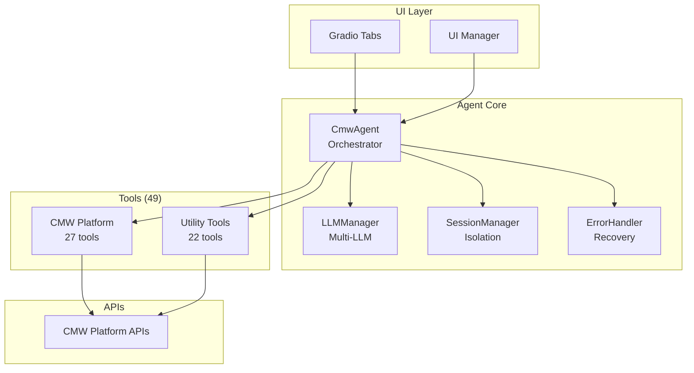

# Comindware Analyst Copilot

**Authors:** Arte(r)m Sedov & Marat Mutalimov
**GitHub:** [https://github.com/arterm-sedov/](https://github.com/arterm-sedov/)  
**Repository:** [https://github.com/arterm-sedov/cmw-platform-agent](https://github.com/arterm-sedov/cmw-platform-agent)

[Ask DeepWiki](https://deepwiki.com/arterm-sedov/cmw-platform-agent)

[](https://deepwiki.com/arterm-sedov/cmw-platform-agent)

## Overview

The Comindware Analyst Copilot is a LangChain-native AI agent designed for creating and managing entities within the CMW Platform. It translates natural language requests into CMW Platform API calls, enabling users to create templates, attributes, workflows, and business processes through conversational AI.

### Key Capabilities

- **CMW Platform Integration**: Create and manage templates, attributes, forms, and business processes
- **Multi-Provider LLM Support**: Support for 6 LLM providers with manual selection
- **Multi-Turn Conversations**: Maintains context and tool call history across conversation turns
- **Real-Time Streaming**: Live response streaming with tool usage visualization
- **Session Isolation**: Each user gets isolated agent instances with proper cleanup
- **Internationalization**: Full support for English and Russian UI
- **Comprehensive Tool Suite**: 49 specialized tools (27 CMW Platform + 22 utility tools)

### Target Use Cases

- **Platform Configuration**: Automate CMW Platform setup through natural language
- **Entity Management**: Batch creation and management of platform entities
- **Developer Evaluation**: Assess agent capabilities for CMW Platform integration
- **Manager Assessment**: Evaluate AI agent technology for business process automation

## Architecture

The system uses a LangChain-native modular architecture designed for reliability and maintainability:



### Core Components

- **CmwAgent** (`langchain_agent.py`) - Main orchestrator using pure LangChain patterns
- **LLMManager** (`llm_manager.py`) - Multi-provider management with persistent instances
- **Tool System** (`tools/`) - 49 tools (27 CMW Platform + 22 utility)
- **UI Layer** (`tabs/`) - Gradio modular tabs with real-time updates
- **Session Management** (`session_manager.py`) - User isolation and cleanup
- **Error Handler** (`error_handler.py`) - Vector similarity error classification
- **Memory Management** (`langchain_memory.py`) - LangChain-native conversation memory
- **Streaming System** (`native_langchain_streaming.py`) - Token-by-token streaming

### Key Design Decisions

- **LangChain-Native**: Pure LangChain patterns ensure compatibility and future-proofing
- **Multi-Provider Support**: Support for 6 LLM providers with manual selection and context preservation
- **Session Isolation**: User data separation and clean conversation contexts
- **Modular Architecture**: Clear separation of concerns for maintainability

## CMW Platform Integration

The agent provides comprehensive integration with the CMW Platform through specialized tools:

### Tool Categories

**CMW Platform Tools (27 tools)**

- **Applications & Templates (6 tools)**: List/create applications, manage templates, generate URLs, process diagrams
- **Attributes (15 tools)**: 12 attribute types (Text, Boolean, DateTime, Decimal, Document, Drawing, Duration, Image, Record, Role, Account, Enum) + general operations (get, create, edit, delete, archive)
- **Templates & Records (6 tools)**: List attributes/records, create/edit templates, form management

**Utility Tools (22 tools)**

- **Search & Research**: Web search, Wikipedia, ArXiv, deep research
- **Code Execution**: Multi-language support (Python, Bash, SQL, C, Java)
- **File Analysis**: CSV, Excel, images, PDFs, OCR text extraction
- **Image/Video Processing**: Analysis, transformation, generation, combination
- **Mathematical Operations**: Basic arithmetic and advanced functions

### Example Workflows

1. **Create Customer Template**: "Create a customer template with name, email, phone, and address fields"
2. **Set Up Workflow**: "Create a workflow for customer onboarding with approval steps"
3. **Bulk Data Import**: "Import customer data from CSV and create records"

## LLM Provider System

The agent supports multiple LLM providers with manual selection:

### Supported Providers

- **OpenRouter** (Default) - Multiple models with 100K-2M token limits, full tool support
- **Google Gemini** - 1M+ token limits, excellent reasoning, full tool support  
- **Groq** - Fast inference, 131K token limits, full tool support
- **HuggingFace** - Local and cloud-based models, 1K-3K token limits, no tool support
- **Mistral** - European AI models with tool support
- **GigaChat** - Russian language models with tool support

### Provider Management

- Manual provider selection through UI
- Context preservation when switching providers
- Sophisticated error classification and recovery suggestions
- Provider-specific error handling and retry timing
- Session-based provider state management

## Getting Started

### Prerequisites

- Python 3.11+
- CMW Platform access credentials
- At least one LLM provider API key

### Installation

1. **Clone and setup**:

   ```bash
   git clone https://github.com/arterm-sedov/cmw-platform-agent
   cd cmw-platform-agent
   pip install -r requirements.txt
   ```

2. **Configure environment**:

   ```bash
   export GEMINI_KEY="your_gemini_key"
   export OPENROUTER_API_KEY="your_openrouter_key"
   export CMW_DEFAULT_LANGUAGE="en"
   ```

3. **Run the application**:

   ```bash
   python agent_ng/app_ng_modular.py
   ```

### Basic Configuration

Set up your CMW Platform connection in the Config tab:
- Platform URL
- Username and password
- Test connection

## Key Features

### Multi-Turn Conversations

- LangChain-native memory management with `ConversationBufferMemory`
- Tool call context preservation across conversation turns
- Session-specific memory instances with automatic cleanup

### Real-Time Streaming

- Token-by-token streaming using LangChain's `astream()` and `astream_events()`
- Tool usage visualization with real-time updates
- No artificial delays - uses LangChain's built-in streaming capabilities

### Session Isolation

- User-specific agent instances with proper isolation
- Session-based file handling and resource management
- Automatic cleanup and memory management

### Internationalization

- Full support for English and Russian languages
- Dynamic language switching using Gradio's I18n system
- Complete UI component translations

### Error Recovery

- Vector similarity for error pattern matching
- Sophisticated error classification and recovery suggestions
- Manual provider switching with context preservation
- Graceful degradation when components fail

### Token Budget Tracking

- Accurate token counting using `tiktoken` with `cl100k_base` encoding
- Real-time token budget snapshots computed at key decision points
- Breakdown display with three components:
  - **Context**: Conversation messages (system, user, assistant) - excludes tool results
  - **Tools**: Tool result messages (ToolMessage content) returned by executed tools
  - **Overhead**: Tool schemas sent with every LLM call (constant per tool set, ~600 tokens per tool)
- API-reported tokens prioritized as ground truth when available
- Event-driven UI updates for immediate budget visibility

**Note**: The estimate may be higher than actual API tokens because it includes tool schemas (overhead) that are sent with every LLM call, while API tokens reflect provider-specific counting and optimization.

### Debug System

- Real-time debug output with categorized logging
- Performance metrics and usage analytics
- LangSmith tracing integration for observability

## Technical Stack

### Core Framework

- **LangChain** - AI framework with native conversation management
- **Gradio** - Modern web UI with modular tab architecture
- **Pydantic** - Data validation and serialization

### Observability

- **LangSmith** - Primary tracing and debugging
- **Langfuse** - Alternative observability platform

### Key Libraries

- `requests` - HTTP client for API calls
- `pandas` - Data analysis and CSV processing
- `pillow` - Image processing and manipulation
- `tiktoken` - Token counting and optimization
- `python-dotenv` - Environment variable management

## Troubleshooting

### Common Issues

1. **LLM Not Loading**
   - Check API keys in environment variables
   - Verify provider availability and rate limits
   - Check network connectivity

2. **Tool Calls Failing**
   - Verify CMW Platform connection in Config tab
   - Check tool permissions and platform access
   - Review error logs in Logs tab

3. **Session Issues**
   - Clear browser cache and restart application
   - Check session isolation in debug logs
   - Verify proper cleanup in session manager

4. **Memory Issues**
   - Check session-specific memory instances
   - Verify conversation context preservation
   - Monitor token usage and limits

5. **Streaming Problems**
   - Verify LangChain version compatibility
   - Check streaming configuration
   - Monitor real-time debug output

### Debug Mode

Enable detailed logging:
```bash
export CMW_DEBUG_MODE=true
export CMW_VERBOSE_LOGGING=true
```

Check logs in the Logs tab or console output for detailed error traces and execution flow.

## Development

### Adding New Tools
1. Create tool function in appropriate category directory
2. Add Pydantic models for parameters in `tools/models.py`
3. Register tool in `tools/tools.py`
4. Test with various LLM providers

### Adding New LLM Providers
1. Add provider enum to `LLMProvider` in `llm_manager.py`
2. Add configuration to `LLM_CONFIGS`
3. Implement provider-specific initialization
4. Test with tool calling and streaming

### Code Style
- Follow LangChain patterns and conventions
- Use Pydantic for data validation
- Run linter: `ruff check agent_ng/ tools/`
- Fix all linting issues: `ruff check --fix --unsafe-fixes agent_ng/ tools/`

## Documentation

- **[API Schemas](cmw_open_api/)** - Complete OpenAPI specifications for CMW Platform integration
- **[Implementation Reports](docs/)** - Detailed progress reports and technical analysis

## Contributing

This is an experimental research project. Contributions are welcome in the form of:

- **Bug Reports** - Issues with agent reasoning or tool usage
- **Feature Requests** - New tools or capabilities for CMW Platform integration
- **Performance Improvements** - Optimizations for speed or accuracy
- **Documentation** - Improvements to guides and code comments

### Development Setup

1. **Activate virtual environment**:
   ```bash
   # Windows
   .venv\Scripts\Activate.ps1
   
   # Linux/Mac
   source .venv/bin/activate
   ```

2. **Run tests**:
   ```bash
   python -m pytest agent_ng/_tests/
   ```

3. **Code style**:
   ```bash
   ruff check agent_ng/ tools/
   ```
