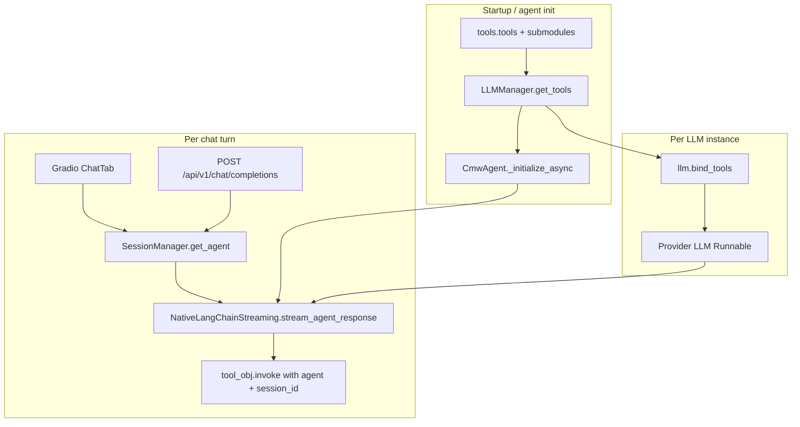

# External MCP Tools Support — Analysis & Implementation Plan

**Date:** 2026-06-04  
**Status:** Phase 0 + Phase 1 MVP implemented (HTTP consumer, default off)  
**Repo:** cmw-platform-agent (platform-generic)

---

## Decision log

| Date | Decision |
|------|----------|
| 2026-06-04 | **Primary MCP consumer transport:** remote **HTTP (Streamable HTTP)** to Gradio-style MCP endpoints (`/gradio_api/mcp/`), not stdio-first. |
| 2026-06-04 | **Phase 1 MVP:** HTTP MCP entries in `config/mcp_servers.yaml`; merge at startup via `langchain-mcp-adapters`. |
| 2026-06-04 | **Registry:** fixed path `config/mcp_servers.yaml` only (no `CMW_MCP_SERVERS_FILE` path override). |
| 2026-06-04 | **Secrets in registry:** `${VAR}` expansion in loader for string fields (e.g. `headers`); missing env → empty string; tokens stay in `.env`. |
| 2026-06-04 | **YAML comments:** short operator hints OK; no path-override or git-tracked boilerplate. |
| 2026-06-04 | **stdio:** secondary — operator desktop / Cursor-parity only; not the default for shared deployments. |

---

## Executive summary

The CMW Platform Agent already runs a mature **in-process Python tool pipeline** (~69 LangChain `BaseTool` instances) loaded via `LLMManager.get_tools()`, bound with `bind_tools()`, and executed in `NativeLangChainStreaming` / `LangChainConversationChain`. **No runtime MCP client exists** today; MCP appears only in operator docs/skills (Cursor-hosted browser/KB MCP) and in superseded April 2026 upgrade notes.

**Recommended direction:** Add an **optional MCP consumer layer** using `langchain-mcp-adapters` (`MultiServerMCPClient`) that merges external tools into the same list used by `get_tools()` → `CmwAgent.tools` → `bind_tools()`. Treat MCP as **opt-in** (env + allowlist), prefix tool names to avoid collisions, and run a **dependency spike first** because `pip install langchain-mcp-adapters` currently pulls **Starlette 1.2.x** while the app pins **Starlette 0.48.0** (Gradio 6.10 / FastAPI 0.119).

**User decision (2026-06-04):** External MCP will connect over **remote HTTP** to **Gradio MCP producer** URLs (Streamable HTTP transport). Example shape (agnostic): `https://example-host/gradio_api/mcp/?tools=ask_comindware`. Phase 1 MVP is scoped to **HTTP server entries only** (one or more URLs in config/env). **stdio** remains supported later for local subprocess servers but is **de-prioritized** for shared/server deployments.

**Out of scope for “external MCP tools” (unless explicitly requested later):** exposing *this* Gradio app as an MCP *server* (`demo.launch(mcp_server=True)` / `/gradio_api/mcp/`). That is the inverse integration path (producer). The consumer path connects *to* remote producers.

---

## 1. What “external MCP tools” means here

| Meaning | Description | In-repo today |
|--------|-------------|---------------|
| **MCP consumer (target)** | Agent process connects to one or more MCP *servers* and exposes their tools to the LLM like native `@tool` functions | Not implemented |
| **MCP host (Cursor)** | IDE loads MCP servers from user config; agent in chat uses those tools via Cursor, not via Python app | Documented in `.agents/skills/cmw-platform*` |
| **MCP producer (Gradio)** | Remote Gradio app publishes API endpoints as MCP tools at `/gradio_api/mcp/` | **Target for consumer** — connect agent to remote producers |

### Transports (consumer) — decided: HTTP-first

Per [LangChain MCP docs](https://docs.langchain.com/oss/python/langchain/mcp), [langchain-mcp-adapters](https://github.com/langchain-ai/langchain-mcp-adapters), and [Gradio MCP guide](https://www.gradio.app/guides/building-mcp-server-with-gradio):

| Transport | Role in this project | `MultiServerMCPClient` field | Notes |
|-----------|----------------------|------------------------------|-------|
| **Streamable HTTP** (`http` / `streamable_http`) | **Primary (MVP)** | `transport`: `"http"` or `"streamable_http"`, `url`, optional `headers` | Gradio 6 default endpoint: `{origin}/gradio_api/mcp/` (trailing slash per Gradio docs). Use underscore form `streamable_http` if validating strictly; `http` is accepted alias. |
| **SSE** | Fallback only | `transport`: `"sse"`, `url` ending in `/gradio_api/mcp/sse` | Deprecated by MCP spec; Gradio docs moved default from `/sse` to streamable HTTP. Prefer streamable HTTP for new integrations. |
| **stdio** | **Secondary** — operator desktop | `command`, `args`, `env`, `transport`: `"stdio"` | Cursor `mcp.json` parity; subprocess on shared servers is higher risk — Phase 2+ or opt-in. |
| **WebSocket** | Not planned | `transport`: `"websocket"` | Out of MVP scope. |

#### Gradio remote MCP URL shape

| Piece | Pattern |
|-------|---------|
| Base (streamable HTTP) | `https://{host}/gradio_api/mcp/` |
| Tool filter (optional) | `?tools={api_name}` or comma-separated `?tools=tool_a,tool_b` — limits tools exposed to the client (Gradio View API / MCP UI builds this when a subset is selected) |
| Schema discovery | `GET …/gradio_api/mcp/schema` |
| Legacy SSE | `…/gradio_api/mcp/sse` (+ optional `?tools=`) |

**Remote client checklist:**

- **Tool subset:** `tools=` query param reduces schema size and prompt bloat; names are Gradio `api_name` values (no UI prefix in the query string).
- **Auth:** Gradio `launch(auth=…)` does **not** protect `/gradio_api/mcp/` by default — use reverse-proxy auth, private network, or pass `headers` (e.g. `Authorization: Bearer …`) in the MCP client config; `MultiServerMCPClient` forwards `headers` on each HTTP request for `http` / `sse` transports.
- **Network:** Agent host must reach the remote URL (egress firewall, TLS, DNS). Browser CORS does not apply to Python `httpx` client calls, but **server-to-server** connectivity and certificate trust do.
- **Producer vs consumer:** Remote URL is another app’s MCP *producer*; this repo implements the *consumer* only in Phase 1.

### Configuration sources (operator) — implemented 2026-06-04

Align with familiar **Cursor / VS Code MCP** patterns without requiring Cursor:

1. **YAML registry** — `config/mcp_servers.yaml` (`servers:` map with HTTP URLs).
2. **Environment toggles** — `CMW_MCP_ENABLED` (default off), `CMW_MCP_ALLOWED_SERVERS`, `CMW_MCP_ALLOWED_HOSTS`, `CMW_MCP_MAX_TOOLS`, `CMW_MCP_TOOL_NAME_PREFIX`.
3. **Not in MVP:** per-Gradio-session MCP config (would need session-scoped tool lists and LLM rebind).

---

## 2. Current tool pipeline



### Discovery & registration

| Step | Location | Behavior |
|------|----------|----------|
| Introspection | `agent_ng/llm_manager.py` → `get_tools()` | Scans `tools.tools`, `attributes_tools`, `applications_tools`, `templates_tools` for `BaseTool` / `@tool`; dedupes by `tool.name`; caches `_cached_tools` |
| Exclusions | `_EXCLUDED` set in `get_tools()` | Drops legacy/agent-internal tools |
| Agent copy | `langchain_agent.py` → `_initialize_async()` | `self.tools = llm_manager.get_tools()` once per `CmwAgent` |
| LLM bind | `llm_manager` `get_llm` / `create_new_llm_instance` | If `tool_support`, `bind_tools(tools_list)`; sets `bound_tools` |
| Count | Runtime | **69** tools loaded (2026-06-04 smoke) |

### Execution & streaming

| Component | Role |
|-----------|------|
| `native_langchain_streaming.py` | Multi-iteration tool loop (`LANGCHAIN_MAX_TOOL_CALL_ITERATIONS`, default 25); resolves tool by `tool.name`; injects `agent` and `set_current_session_id()` |
| `langchain_memory.py` | Non-streaming `_execute_tool` / `_run_tool_calling_loop` (tests) — same name lookup |
| `token_budget.py` | Estimates tool schema size for context budget (`_calculate_avg_tool_size`) |
| `streaming_config.py` | Max iterations from env |

### Auth / secrets (native tools)

- CMW credentials: `.env` / session config (`CMW_BASE_URL`, `CMW_LOGIN`, `CMW_PASSWORD`) — not part of tool registry.
- Provider keys: per-session `llm_provider_api_keys` + env defaults.
- OpenAI-compat API: Bearer token → provider key for that request.

**MCP gap:** No path to load third-party server env (e.g. `TAVILY_API_KEY` in MCP server subprocess) from app config.

---

## 3. Integration points for an MCP client

| Hook | When | Recommendation |
|------|------|----------------|
| **`LLMManager.get_tools()`** | Process startup / first access | **Primary merge point** — append MCP `BaseTool` instances after Python tools |
| **`CmwAgent._initialize_async()`** | Per session agent | Must see merged list; if MCP load is async, await before setting `self.tools` |
| **`bind_tools()`** | New/rebound LLM instance | Re-run when MCP tool set changes; invalidate cached LLM instances or force new instances |
| **`NativeLangChainStreaming`** | Tool invoke | **No change** if MCP adapters return standard `BaseTool` with `.name` / `.invoke()` |
| **SessionManager / SessionData** | Per-user agent | MVP: shared global MCP tools; later: optional per-session allowlist |

### Startup vs session vs request

| Model | Pros | Cons |
|-------|------|------|
| **Process startup (recommended MVP)** | Matches `_cached_tools`; one subprocess spawn per tool call (adapter default) | Requires async init bridge; restart to change config |
| **Per session** | Tenant isolation | Must rebind tools per session; memory; complex |
| **Per request** | Fresh servers | Latency; incompatible with current caching |

**Async note:** `MultiServerMCPClient.get_tools()` is **async**. `get_tools()` is **sync** today. Options: (a) load MCP tools in `asyncio` during app init and store in `_cached_tools`, (b) dedicated `async_get_tools()` called from `_initialize_async` only, (c) `asyncio.run()` in sync path (avoid in Gradio callback threads).

---

## 4. LangChain alignment (AGENTS.md)

| Principle | Application to MCP |
|-----------|-------------------|
| LCEL / Runnables | MCP tools should be `langchain_core.tools.BaseTool` from `langchain-mcp-adapters` — same `bind_tools` + `invoke` path |
| Typed schemas | MCP JSON Schema → Pydantic via adapter; preserve strict provider behavior where supported |
| Streaming-safe | Tool *results* already streamed as `tool_end` events; MCP per-call sessions should not break generator |
| Non-breaking | `CMW_MCP_ENABLED=false` (default) → identical tool list to today |

**Not required for MVP:** migrate to `langchain.agents.create_agent` — current custom streaming loop is entrenched and works with bound tools.

---

## 5. Configuration model

### Proposed env vars (`.env.example` placeholders only)

```bash
# External MCP tools (off by default; registry: config/mcp_servers.yaml)
# CMW_MCP_ENABLED=false
# CMW_MCP_TOOL_NAME_PREFIX=true
# CMW_MCP_ALLOWED_SERVERS=ennoia_kb
# CMW_MCP_ALLOWED_HOSTS=ennoia.slickjump.org
# CMW_MCP_MAX_TOOLS=20
REMOTE_MCP_BEARER_TOKEN=
```

### YAML registry (`config/mcp_servers.yaml`)

Fixed path: `config/mcp_servers.yaml`. Lists deployment MCP producers (team test URLs in git).

```yaml
# External MCP servers — set CMW_MCP_ENABLED=true in .env to load at startup.
servers:
  comindware_kb:
    transport: streamable_http
    url: https://ennoia.slickjump.org/gradio_api/mcp/?tools=ask_comindware
    # Optional bearer (set REMOTE_MCP_BEARER_TOKEN in .env):
    # headers:
    #   Authorization: "Bearer ${REMOTE_MCP_BEARER_TOKEN}"
```

| Concern | Decision |
|---------|----------|
| Hot-reload | **No** in MVP — require process restart (matches `_cached_tools` lifecycle) |
| Secrets | `headers` (and other strings) may use `${ENV_NAME}`; expand at load from process env; never commit bearer tokens |
| Registry file | `config/mcp_servers.yaml` only |
| Allowlist | `CMW_MCP_ALLOWED_SERVERS` filters keys in YAML |
| Collision | `tool_name_prefix=true` → `servername_toolname` |
| URL allowlist | Optional `CMW_MCP_HTTP_ALLOWLIST` host patterns (Phase 3) — mitigates SSRF if config is operator-controlled |
| Tool filter | Prefer `?tools=` on URL when producer exposes many endpoints; complements server-level allowlist |

---

## 6. Security

| Risk | Mitigation |
|------|------------|
| Arbitrary subprocess (stdio) | **Secondary transport** — opt-in; allowlist server names; consider **disabling stdio** on shared deployments (HTTP-only mode) |
| SSRF / exfil (HTTP MCP) | Allowlist URLs; optional `CMW_MCP_HTTP_ALLOWLIST` host patterns; only operator-supplied Gradio MCP bases |
| Remote Gradio MCP auth gap | Document that producer `auth=` may not cover `/gradio_api/mcp/`; require proxy tokens or `headers` in config |
| Egress / TLS | Agent process must reach configured MCP host(s); log connection failures without leaking tokens |
| Secret leakage in logs | Log server name + tool name, not args; extend existing openai_compat debug discipline |
| Tool sprawl / prompt injection | Cap tools per server; max total MCP tools; exclude sensitive native + MCP combos |
| Supply chain | Pin `langchain-mcp-adapters` and `mcp` in `requirements.txt` after spike |
| Multi-tenant Gradio | Same MCP tools for all sessions in MVP — document that MCP is deployment-level trust |

**Audit:** Add structured log line on MCP tool invoke: `mcp_server`, `tool_name`, `session_id`, duration, success/failure.

---

## 7. UI / API impact

| Surface | Impact |
|---------|--------|
| **Gradio Chat** | None if tools are merged internally; optional Config tab later for enable/allowlist |
| **POST /api/v1/chat/completions** | No contract change; external clients get MCP capabilities implicitly when server enabled |
| **Statistics / token budget** | Tool count and schema size increase — may trigger compression sooner |
| **Footer “View API” / MCP** | Separate feature: `mcp_server=True` exposes *this app* as MCP server (not consumer) |

---

## 8. Testing strategy (TDD)

| Layer | Tests |
|-------|--------|
| **RED: config** | Parse `config/mcp_servers.yaml`; allowlist; invalid transport |
| **RED: merge** | `get_tools()` with mocked `MultiServerMCPClient` returns fixed `BaseTool` |
| **RED: bind** | LLM instance receives native + MCP tool names (mock LLM `bind_tools`) |
| **RED: execute** | Streaming loop invokes MCP tool by prefixed name |
| **Integration** | `@pytest.mark.integration` — HTTP to a **local** Gradio app with `mcp_server=True` (or mock HTTP transport); skip if `CMW_MCP_INTEGRATION_TESTS!=1` |
| **Integration (optional)** | stdio sample server — Phase 2+ only |
| **Non-goals** | Do not test Cursor IDE MCP host; do not test full browser MCP in CI; do not hit production tenant URLs in CI |

**Verification commands (post-implementation):**

```bash
ruff check agent_ng/mcp_tools.py agent_ng/llm_manager.py
python -m pytest agent_ng/_tests/test_mcp_tools.py -m "not slow"
python -m pytest agent_ng/_tests/test_mcp_tools_integration.py -m integration  # optional
```

---

## 9. Alternatives

| Option | Effort | Fit |
|--------|--------|-----|
| **A. `langchain-mcp-adapters`** | M | **Chosen** — returns `BaseTool`; `http`/`streamable_http` for Gradio remote MCP |
| **B. Raw `mcp` SDK + hand-rolled `StructuredTool`** | L | Full control; duplicates adapter maintenance |
| **C. Codegen/wrap selected MCP servers as Python in `tools/`** | M per server | Stable but not dynamic; good for one known server (e.g. KB) |
| **D. Subprocess bridge to Cursor CLI** | L | Fragile, not portable |
| **E. Gradio as MCP client only (`smolagents.MCPClient`)** | M | Different stack; does not integrate with current LangChain agent |
| **F. Expose app as MCP server (`gradio[mcp]`)** | S–M | Complementary — lets *other* hosts call Gradio APIs, not this task |

---

## 10. Phased rollout

| Phase | Scope | Size | Notes |
|-------|--------|------|-------|
| **0 — Spike** | Install `langchain-mcp-adapters`; connect to **local** `demo.launch(mcp_server=True)` at `/gradio_api/mcp/`; pytest subset; resolve Starlette conflict | **S** | Validate `transport: "http"` against Gradio 6.10 |
| **1 — MVP** | `CMW_MCP_ENABLED`; `config/mcp_servers.yaml` + env toggles; merge at startup; prefix names; logging; optional `?tools=` URLs | **M** | Non-breaking default off; **no stdio in MVP** |
| **2 — stdio** | Optional stdio blocks in same YAML registry for desktop operators | **M** | stdio secondary |
| **3 — Hardening** | Tool caps, HTTP host allowlist, integration tests, docs (auth headers, network) | **M** | |
| **4 — Optional** | Config UI tab; per-session allowlist; selective tool import | **L** | |
| **5 — Optional** | `mcp_server=True` producer mode for *this* app | **M** | Separate PR — inverse path |

**Backward compatibility:** Default `CMW_MCP_ENABLED=false`; no change to existing 69 tools; no new required env vars.

---

## 11. Effort / risk summary

| Item | Risk | Mitigation |
|------|------|------------|
| Starlette 0.48 → 1.x via `mcp` dep | **High** | Phase 0 spike; pin compatible versions; test `demo.launch()` |
| Context window / tool schema bloat | **Medium** | Tool allowlist per server; max MCP tools; monitor `token_budget` |
| Async vs sync init races | **Medium** | Load MCP only in app init / `_initialize_async`; block chat until ready |
| stdio subprocess on Windows | **Low (de-prioritized)** | Phase 2+; document Node/Python paths when stdio ships |
| Remote HTTP unreachable / TLS | **Medium** | Clear operator docs; structured connect errors; optional health check at startup |
| Gradio `?tools=` mismatch | **Low** | Validate against `/gradio_api/mcp/schema`; fail fast on empty tool list |
| Name collisions with 69 native tools | **Low** | `tool_name_prefix` |
| Operational trust | **High** | Clear docs: MCP = same privilege as shell access |

---

## 12. Prior research in repo (superseded notes)

- `.opencode/plans/20260422_mcp_integration_implementation_plan.md` — assumed LangChain 0.3 / Gradio 5; **obsolete** (repo now LangChain 1.2.17, Gradio 6.10.0).
- `.opencode/plans/20260422_langchain_gradio_version_analysis.md` — migration rationale still useful; version table outdated.
- April 2026 notes referenced a specific tenant Gradio MCP host — superseded by agnostic `https://example-host/gradio_api/mcp/` pattern above.

---

## 13. Open questions

### Decided

| Topic | Decision |
|-------|----------|
| **Primary transport** | Remote **HTTP (Streamable HTTP)** to Gradio `/gradio_api/mcp/` URLs; optional `?tools=` filter on URL. |
| **Phase 1 scope** | HTTP MCP server entries in config/env only; merge at startup. |
| **stdio** | Secondary / operator-desktop; not MVP default. |

### Still open

1. **Auth model:** Bearer in `headers` only, or also mutual TLS / reverse-proxy contract? Who issues tokens for remote Gradio producers?
2. **Which HTTP servers first:** Comindware KB Gradio MCP, internal RAG Space, other — ordered rollout list.
3. **Tool budget:** allow all tools from each URL or hard cap (e.g. 20 total MCP tools) given ~69 native tools already bound?
4. **Multi-server list:** flat YAML keys in `config/mcp_servers.yaml` (implemented) vs env-only single URL?
5. **Producer mode:** should *this* app also expose `mcp_server=True` for other hosts? (unchanged — separate PR)
6. **Per-session MCP:** required for multi-tenant, or deployment-level config enough?
7. **SSE fallback:** require explicit `transport: "sse"` + `/gradio_api/mcp/sse` only when streamable HTTP fails on a given host?

---

### Footnote — registry vs docs

`config/mcp_servers.yaml` may list team-agreed producer URLs (e.g. test endpoint with `?tools=ask_comindware`). Narrative docs and `.env.example` stay agnostic; do not commit bearer tokens in the tracked registry.

---

## References

- [LangChain — Model Context Protocol (MCP)](https://docs.langchain.com/oss/python/langchain/mcp) — `http` / `streamable_http`, `headers` on remote servers
- [langchain-mcp-adapters — MultiServerMCPClient](https://reference.langchain.com/python/langchain-mcp-adapters/client/MultiServerMCPClient) — `transport` must be `stdio`, `sse`, `websocket`, or `streamable_http` / `http` (not hyphenated `streamable-http` in strict validation)
- [langchain-mcp-adapters — sessions](https://github.com/langchain-ai/langchain-mcp-adapters/blob/main/langchain_mcp_adapters/sessions.py) — transport routing
- [Gradio — Building MCP server with Gradio](https://www.gradio.app/guides/building-mcp-server-with-gradio) — `mcp_server=True`, `/gradio_api/mcp/`, schema URL, `mcp-remote` bridge for legacy clients
- [Gradio — `?tools=` URL builder](https://github.com/gradio-app/gradio/commit/02ce6d5b768ddf68241bee92e11a166e97fd9b2d) — streamable HTTP default; optional tool subset query
- [MCP — Streamable HTTP transport spec](https://modelcontextprotocol.io/specification/2025-03-26/basic/transports#streamable-http)
- In-repo: `agent_ng/llm_manager.py`, `agent_ng/native_langchain_streaming.py`, `agent_ng/openai_compat.py`, `docs/plans/openai_chat_completions_compat.md`
